class: title-slide, left, middle
```{r setup, include = FALSE}
library(tidyverse)
library(knitr)
opts_chunk$set(echo = FALSE, fig.width = 7.252, fig.height = 4, dpi = 300)
```


```{r}
xaringanExtra::use_tile_view()
xaringanExtra::use_animate_all(style = "fade")
xaringanExtra::use_scribble()
xaringanExtra::use_panelset(in_xaringan = TRUE)
xaringanExtra::use_logo(
    image_url = "Images//GCPS_logo.png",
    width = "250px",
    height = "125px",
    link_url = "https://gcps.edu.gh/",
    exclude_class = "title-slide"
)

```


# `r rmarkdown::metadata$title`
----
<br> 
.right[
### `r rmarkdown::metadata$institute`
### `r rmarkdown::metadata$date`
`r rmarkdown::metadata$author` .title-t[FWACP FGCPS]
]

---
class: wine-slide middle center
# No conflict of interest to declare.
----

---
class: about-slide middle center

# About me


## Samuel Blay Nguah

###Senior Lecturer in Pediatrics <br>
###School of Medicine & Dentistry <br>
###Kwame Nkrumah University of Science and Technology


[`r fontawesome::fa("book")` E-book](https://medstatswithr.netlify.app)
[`r fontawesome::fa("twitter")` @sbnguah](https://twitter.com/sbnguah)
[`r fontawesome::fa("link")` @sbnguah](https://github.com/sbnguah)
[`r fontawesome::fa("github")` @sbnguah](https://github.com/sbnguah)

---
# Outline
----
.pull-left[
## Epidemiology
- Definition of some terminologies
- Epidemiological study designs
- Measures of association
- Evaluating a diagnostic test
]

.pull-right[
## Biostatistics
- Variable types
- Description statistics
    - Central tendency
    - Dispersion
    - Proportional representation
- Z-Score & Normal distribution
- Inferential statistics
]

---
class: inverse middle center

# Some Terminologies.
----

---
#Ratio & Proportion
----
##Ratios
- Compare measurements of the same units
- Expressed as proportion
- Units not important
- E.g:  In a class with 25 males and 50 females
            
   Male to Female ratio $= \frac{25}{50}=\frac{1}{2}=0.5$

##Proportion
- Similar  to ratio but the denominator also includes the numerator

 Proportion of males $= \frac{25}{25+50}=\frac{1}{3} = 0.33=33.3\%$

---
#Some Terminologies
----
##Rates
- Numerator and denominator have different units
- Always expressed with units
- Has a time factor (e.g person-years)
- Often has a multiplier  x $10^n$
- If 25 Road Traffic Accidents are recorded in a year in a population of 5000 this rate can be recorded as

$$\frac{25}{5000} = \frac{50}{10000} = 5/1000$$

And reported as **5 per $10^3$** RTA per year

---
# Types of Rates
----
## Crude rates
- Applies to the total population in an area

## Specific rates
- Applies to the specific sub-groups (age, sex, etc) or specific disease

## Standardised rates
- Used to permit comparison of rates in populations which differ in structure (e.g. age structure). Two main types.
    - Direct standardization
    - Indirect standardization

---
#Some Terminologies
----
.pull-left[
##Population at risk
- Includes people who are potentially susceptible to the diseases being studied. 
- E.g.: Ca cervix in women

##Exposure
- Broadly applied to any factor that may be associated with an outcome of interest.
- E.g. Sex, Age, obesity, cigarette smoking, etc
]

.pull-right[
##Outcome
- Any defined disease, state of health, health-related event or death

## Case
- A known to have the outcome

## Control
- Known  free of the outcome
]

---
# Measuring disease frequency
----
##Incidence (Incidence rate)
- Rate of occurrence of new cases arising in a given period in a specified population

## Prevalence (Prevalence rate)
- The frequency of existing cases in a defined population at a given point in time

## Cumulative Incidence 
$$= \frac{Number \: of \: new \: cases \: in \: a \: time \: period}{Persons \: at \: risk \: at \: the \: beginning \: of \: the \: time \: period}$$

---
# Incidence vs. Prevalence
----
.pull-left[
## Incidence
- This is the **Risk**
- Asks the question **How fast?**

$$Incidence \; (Rate) = \frac{Number \; of \; new \; cases}{Population \; at \; risk \; in \; any \; given \; time} $$
]

.pull-right[
## Prevalence
- This is the **Burden**
- Asks the question **How much?**

$$Prevalence \; (proportion) = \frac{Number \; of \; cases \; with \; disease}{Total \; Population} $$
]


---
#Other epidemiological rates
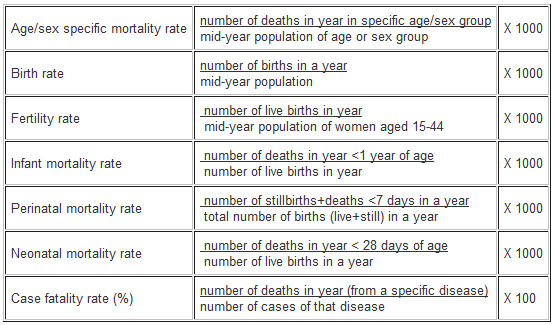

---
class: inverse middle center
# Study Designs
----

---
class: top
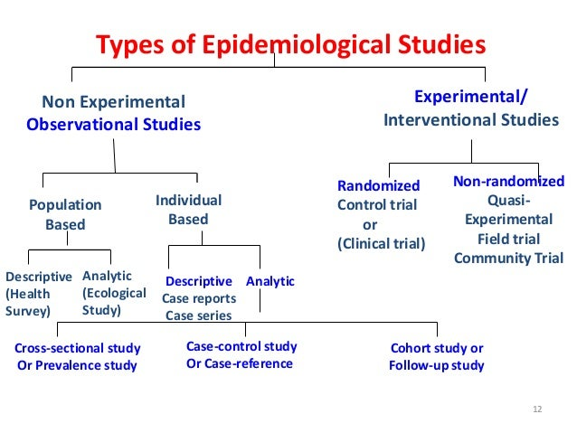

.footnote[sourse: https://thefuturedentistry.com/epidemiology-mcq/]
---
# Hierarchy of study design
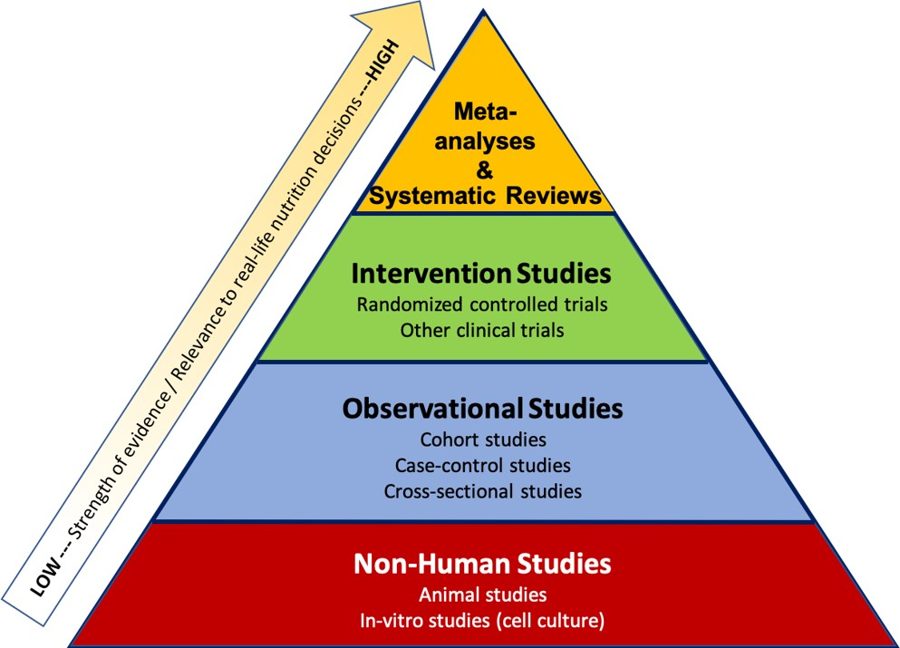


---
class: inverse center middle
# Measures Of Association
----

---
#Risk and Odds
----
.pull-left[
## Risk
- Risk (probability, likelihood)
    - Probability of outcome in a specified period
    - If 200 children in a boarding school ate rice and 28 had diarrhoea then 
    
$$ R_𝑒 = \frac{28}{200} = 0.14 = 14\% $$
]

.pull-right[
## Odds
$$ = \frac{Risk\ of\ getting\ the\ disease}{(Risk\ of\ not\ getting\ the\ disease)} $$
$$ Odds_e = \frac{0.14}{1-0.14} = \frac{0.14}{0.86} \approx 0.16$$
]

---
# Risk Ratio 
----

$$RR = \frac{Incidence\ in\ the\ exposed}{Incidence\ in\ the\ non-exposed} = \frac{R_e}{𝑅_𝑢}$$
- Used for estimation of a causal relationship
- Can be calculated in cohort studies
- Higher RR => Better causal relationship
    - RR=1      =>  No evidence of association
    - RR $\neq$ 1   =>  Exposure is harmful or protective

---
# Odds Ratio (OR)
----


$$OR = \frac{Odds\ in\ the\ exposed}{Odds\ in\ the\ non-exposed} = \frac{Odds_e}{Odds_𝑢}$$
- Also called cross product
- Very useful in statistical manipulations
- Helps to prove association but not causation
- Useful in Case-control studies – No incidence!!
- Close to RR if Matching & Disease is rare
- Higher OR => Better causal relationship
    - OR = 1        =>  No evidence of association
    - OR $\neq$ 1   =>  Exposure is harmful or protective

---
# Atributable Risk
----
- It is a rate, not a ratio
- The rate or incidence of a disease in an exposed group that can be attributed to the exposure
- Expressed as case per multiple of population
- Used to determine the amount of disease that could be eliminated by removing the exposure

$$AR = 𝐼_𝑒  −𝐼_𝑢$$

---
# Number needed to Treat/Harm
----
.pull-left[
## Number Needed to Treat (NNT)
- What number of persons need to be treated for one person to benefit?
- For every NNT persons treated ONE outcome is prevented or avoided
]

.pull-right[
## Number Needed to Harm (NNH)
- What number of persons need to be treated for one person to be harmed?
- For every NNH persons treated ONE  outcome is seen in those treated.
]

---
class: gold-slide center middle

# Evaluating a diagnostic test
----

---
#Evaluating a diagnostic test
----

.pull-left[
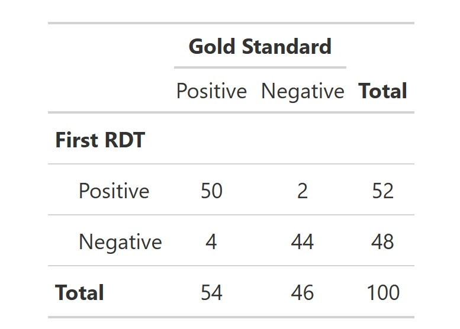
]

.pull-right[
## Thus 
- True Positive = 50
- True Negative = 44
- False Positive = 2
- False negative = 4
]

---
# Prevalence of the disease
----
.pull-left[
## True prevalence
- The gold standard determined proportion of the diseased individuals observed in the study population. 

 $$True~prev. = \frac{tp + fn}{tp + tn + fp + fn}$$
]

.pull-right[
## The apparent prevalence
- The test determined proportion of the diseased individuals observed in the study population. 

 $$Apparent~prev. = \frac{tp + fp}{tp + tn + fp + fn}$$
]

---
# Sensitivity
----
.pull-left[
- Proportion of individuals identified by the test with the disease who have the disease. 
- It ranges from 0% (Useless) to 100% (Perfect) 

$$Sensitivity = \frac{tp}{tp + fn}$$
]

.pull-right[
- A test with high sensitivity is useful for ‘ruling out’ a disease if a person tests negative

**High Sensitivity, Negative test = rule out**
]

---
# Specificity
----
.pull-left[

- The proportion of individuals without the 
disease who are correctly identified by the test used. 
- It ranges from 0% (Useless) to 100% (Perfect) 

$$Specificity = \frac{tn}{tn + fp}$$
]

.pull-right[
- A test with high specificity is useful for ‘ruling in’ a disease if a person tests positive

**High Specificity, Positive test, rule in disease**
]

---
#Predictive Values
----
.pull-left[
##Positive predictive value
- Proportion of individuals with a positive test result who have the disease. 
- Indicates how much weight one has to put on a positive test result when confronted with one. 

$$PPV = \frac{tp}{tp + fp}$$
]

.pull-right[
##Negative predictive value
- Proportion of individuals with a negative test result who do not have the disease. 
- Indicates how much weight one has to put on a negative test result when confronted with one. 

$$NPV = \frac{tn}{tn + fn}$$
]

---
# Likelihood Ratios
----
.pull-left[
## Positive Likelihood Ratio (LR+)
- Ratio of the chance of a positive result if the patient has the 
disease to the chance of a positive result if he does not.
- The higher the LR+ the better the test at picking up the disease.
- **LR+  >10: Rules IN the disease**
- LR+  <0.1: Rules OUT the disease


$$LR+ = \frac{Sensitivity}{1-Specificity}$$
]
.pull-right[
## Negative Likelihood Ratio(LR-)
- Ratio of the chance of a person having a negative result having the disease to the chance of a negative result in a person not having the disease. 
- The lower the LR- the better the test ruling out the disease.
- LR-  >10: Rules IN the disease
- **LR-  <0.1: Rules OUT the disease**


$$LR+ = \frac{1-Sensitivity}{Specificity}$$
]

---
class: gold-slide middle center
# Descriptive Statistics
----

---
class: center, middle
#Data Types
--
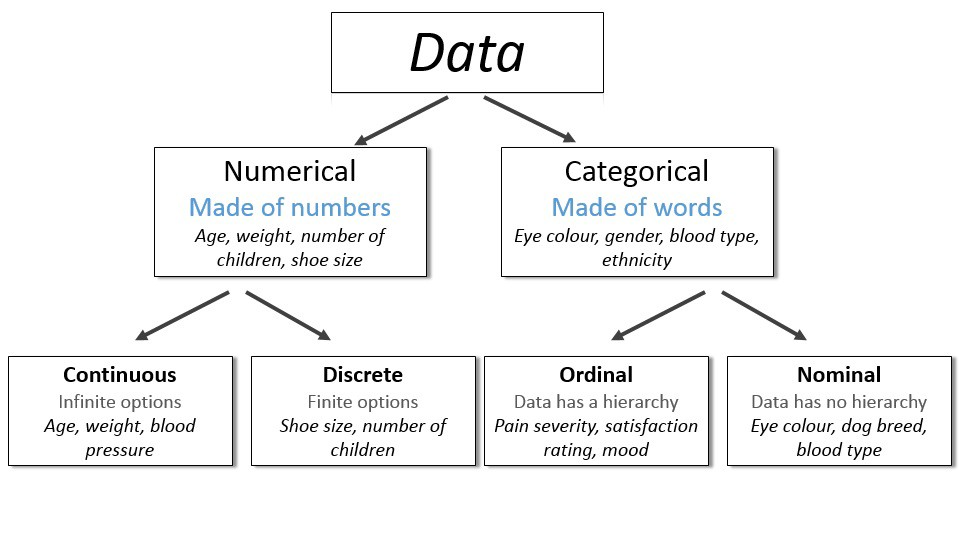

---
# Variable types
----
## Independent (predictor) variable 
- Potentially influences, affects or predicts another variable
- E.g: How age influences income makes age the independent variable

## Dependent (predicted) variable 
- Potentially predicted, influenced and affected by another variable
- E.g: How age influences income makes income the dependent variable

---
# Descriptive statistics
----
.pull-left[
## Categorical variable
- Frequency tables – univariate
- Contingency tables – bivariate
    - Row percentage
    - Column percentage
- Graphical representations
    - Bar chart
    - Pie Chart
    - Others
- Odds & Odds Ratio
- Risk & Risk Ratio
]

.pull-right[
## Continuous Variable
- Measures of central tendency
    - Mean
        - Arithmetic Mean
        - Geometric mean
        - Harmonic mean
    - Median
    - Mode
- Measures of dispersion
    - Standard deviation
    - Variance
    - Interquartile range
    - Range
]
 
---
# Descriptive statistics
----
.pull-left[
## Measures of central tendency
- Mean 
- Median
- Mode
]

.pull-right[
##Measure of Dispersion
- Range 
    – Minimum to maximum 
- Interquartile range
    - p25 - p75
- Quartiles
    - Minimum, p25, p75, maximum
- Standard Deviation
- Variance
]

---
#Measures of central tendency
----
## Mean
- Average: Sum of all observations divided by the total number
- Others include:
    - Geometric mean
    - Harmonic mean

## Median 
- Middle-value of the given set of data when arranged in a particular order

## Mode
- The most frequent number occurring in the data set


---
# Shape of data
----
#Skewness
.center[
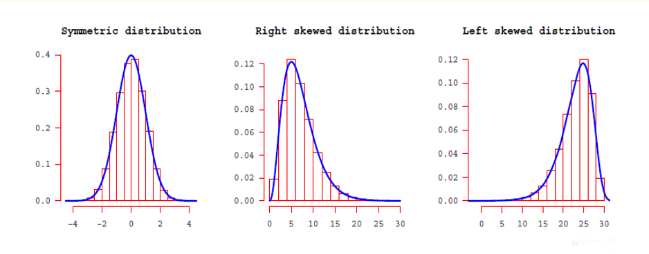
]

---
# Shape of data - Mean, median, mode 
----
.center[
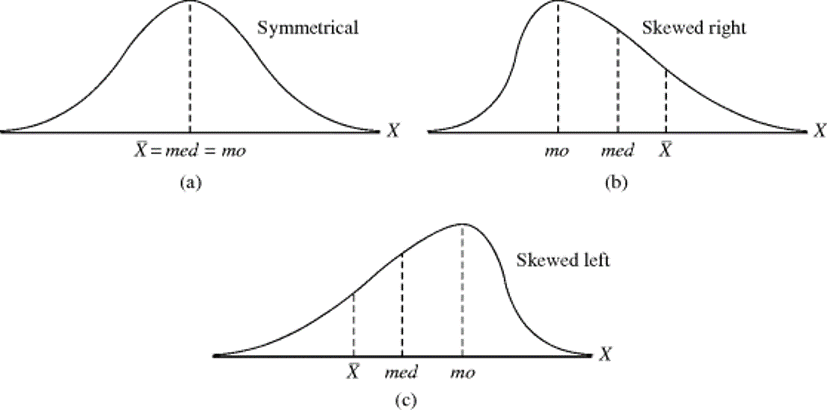
]

---
#Measures of proportional representation
----
##Percentile
The $p^{th}$ percentile is the statistic that has p% of the values below it.

##Quantile
- A quantile divides quantitative data into equal parts.
    - **Quartile**: 4 equal parts
    - **Decile**: 10 equal parts
    - **Percentile**: 100 equal parts
    - **Quintile**: 5 equal parts

---
class: middle center

.left-column[
#Centile Chart
]

.right-column[
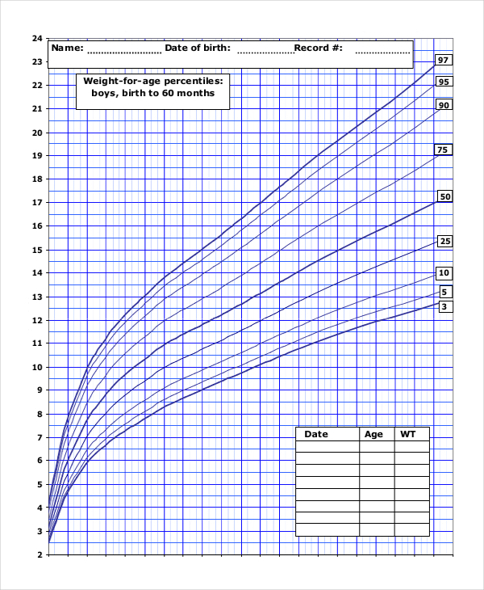
]

---
class: middle center
# Quartile
--
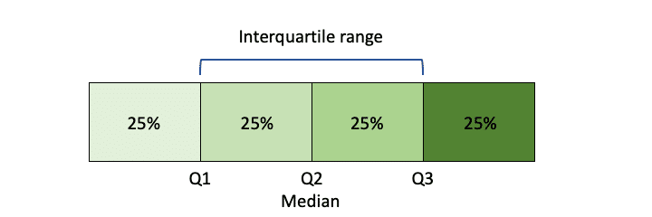

---
class: middle center
# Boxplot
--


---
# Boxplot
----
```{r fig.retina=3, fig.width=9, fig.height=4.5, warning=F}
df_newdrug <- readstata13::read.dta13("./Dataset/NewDrug.dta")
df_newdrug %>% 
    mutate(treat = factor(treat, levels = c(0, 1), labels = "Case","Control")) %>% 
    select(bp1, sex, treat) %>% 
    na.omit() %>%
    ggplot(aes(x = treat, y = bp1, color = sex))+
    geom_boxplot() +
    theme_light() +
    labs(x = "Case or Control", y = "Weight (hgs)") + 
    theme(plot.title=element_text(size=15, face="bold"), 
          axis.text.x=element_text(size=12), 
          axis.text.y=element_text(size=12),
          axis.title.x=element_text(size=13),
          axis.title.y=element_text(size=13)) + 
  scale_color_discrete(name="Sex")
```

---
# Measures of Dispersion
----
- Determines how widespread the data is
- Range (Minimum to Maximum)
- Interquartile range
- Variance
- Standard Deviation
- Coefficient of variation


---
# Measures of Dispersion
```{r}
x <- c(
    rnorm(200, mean = 10, sd = 2), 
    rnorm(200, mean = 10, sd = 4),
    rnorm(200, mean = 10, sd = 6))
grp <- factor(c(rep("A", 200), rep("B", 200), rep("C", 200)))
df_temp <- data.frame(x, grp) 
df_temp %>% 
    ggplot(aes(x = x))+
    geom_histogram(
        aes(y=after_stat(density)), 
        bins=10, fill = "red", col = "black") +
    labs(x = NULL, y = NULL) +
    theme_bw()+
    facet_wrap(grp)
```


---
# Tabular presentation
----
.pull-left[
```{r message=FALSE, warning=FALSE}
gtsummary::theme_gtsummary_eda()
df_newdrug %>% 
    gtsummary::tbl_summary(
        include = c(bp1, bp2),
        label = list(bp1 ~ "First BP", bp2 ~ "Second BP")
    ) %>% 
    gtsummary::bold_labels() %>% 
    gtsummary:: modify_caption(
        caption = "**Univariate descriptive statistics**"
    )
```
]

.pull-right[
```{r message=FALSE, warning=FALSE}
df_newdrug %>% 
    gtsummary::tbl_summary(
        include = c(bp1, bp2, sex),
        label = list(bp1 ~ "First BP", bp2 ~ "Second BP"),
        by = sex
    ) %>% 
    gtsummary::bold_labels() %>% 
    gtsummary:: modify_caption(caption = "**Bivariate descriptive statistics**")

gtsummary::reset_gtsummary_theme()
```
]

---
class: gold-slide middle center

#The Normal Distribution
----

---
# Normal distribution
----
##Properties
.pull-left[
- Bell-shaped
- Same Mean, median and mode 
- Symmetrical
- Basis of many statistical manipulations
- Described by the mean and standard deviation only
]

.pull-right[
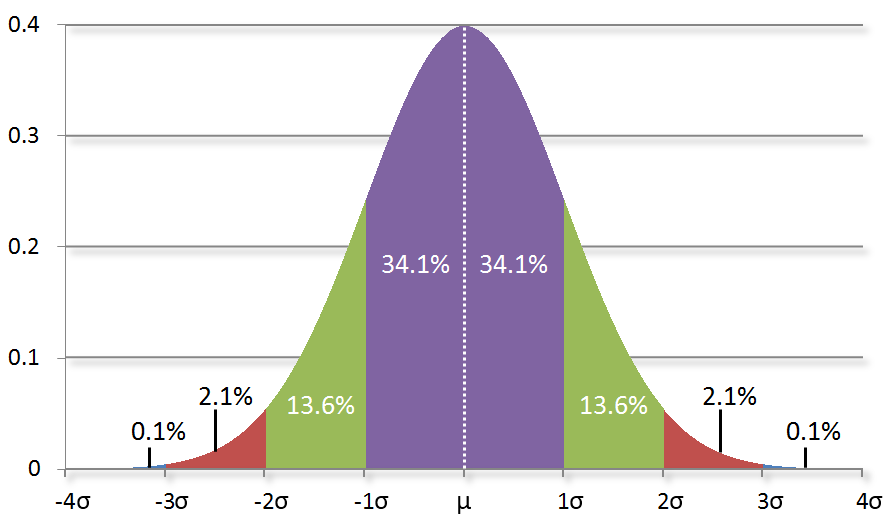
]

---
#Z-Score
----
.pull-left[
##Formula

$$Z = \frac{X-\mu}{\sigma}$$
### Where
- $X$ is a raw score, a value on some acceptable $X$
- $\mu =$ is population mean
- $\sigma$ is the population standard deviation
]

.pull-right[
## Example
- For a z-score of a child who weighs 10kgs in an age group with a mean weight of 12kgs and standard deviation of 2. 

$$Z = \frac{X-\mu}{\sigma} = \frac{10-12}{2} = -1$$
]

---
class: gold-slide middle center 
#Descriptive statistics - Categorical 
----

---
# Categorical variables
----
.pull-left[
##Univariate analysis
```{r warning=F, echo = F}
df_newdrug %>% 
    mutate(
        treat = factor(treat, 
                       levels = c(0, 1), 
                       labels = "Case","Control")) %>% 
    gtsummary::tbl_summary(
        include = c(sex, treat), 
        statistic = gtsummary::all_categorical() ~ c("{n} ({p})"),
        digits = gtsummary::all_categorical() ~ c(0,1),
        label = list(
            sex ~ "Sex of Participant",
            treat ~ "Case1 or Case2")
    ) %>%
    gtsummary::bold_labels() %>% 
    gtsummary::add_stat_label() %>% 
    gtsummary:: modify_caption(caption = "Univariate categorical table")
```
]

.pull-right[
## Bivariate analysis

```{r warning=F, echo = F}
df_newdrug %>% 
    mutate(
        treat = factor(treat, 
                       levels = c(0, 1), 
                       labels = "Case","Control")) %>% 
    gtsummary::tbl_cross(
        row = sex,
        col = treat,
        percent = "row",
        label = list(sex ~ "Sex of Participant",
                     treat ~ "Case1 or Case2")
    ) %>% 
     gtsummary::bold_labels() %>% 
     gtsummary:: modify_caption(caption = "Bivariate categorical table") %>% 
     gtsummary::italicize_levels()
```
]

---
# Barchart
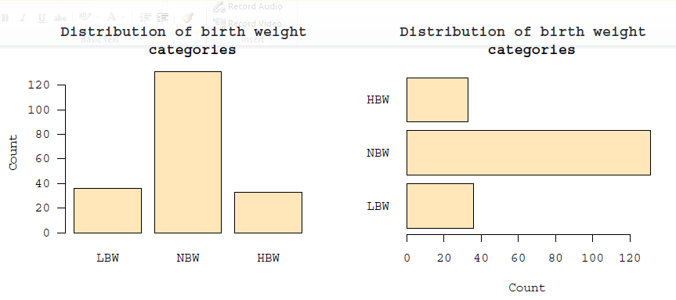

---
# Barchart
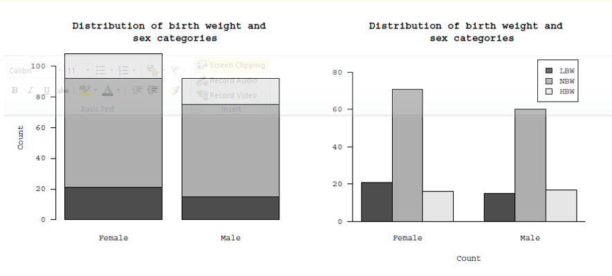

---
class: gold-slide middle center
#Inferential statistics
----

---
#Hypothesis testing
----
## Hypothesis
- Studies start with a  hypothesis
>**Study title:** Comparison of serum cholesterol of children with and without malnutrition

## Null Hypothesis
> ** $H_0$ **: There is no difference in serum cholesterol concentration between the children with and without malnutrition

## Alternate hypothesis
> ** $H_a$ **: There is a difference in serum cholesterol concentration between the children with and without malnutrition

---
# P-value
----
##Definition
>p-value is the probability of obtaining results at least as extreme as the observed results of a statistical hypothesis test, assuming that the null hypothesis is correct.

## Properties
- Well-known in research
- Very often *misinterpreted* and *overemphasized*
- Ranges from 0 to 1
- The nearer p-value is to 1 the better the support for **H<sub>0<sub\>**.

---
#P-Value
----
##Example
In our study above the following results were obtained:

>mean(SD) of the serum cholesterol for children with malnutrition and those without were 46(12) and 95(15)with a p-value of 0.012 

##Interpretation
> The probability of observing such a difference in the result between the two groups if the serum cholesterol was equal in the population (H0) is 0.012. Thus, based on this evidence, we will reject the null hypothesis and conclude that there is a significant difference between the serum cholesterol of children who have and do not have malnutrition.  

---
# Confidence interval
----
##Definition

>The 95% confidence interval is the confidence interval that is likely to contain the population statistic 95% of the time.

# Determinants
- Size of CI 95%, 99%, etc
- Sample size
- Sample variability
- Method used for its calculation

---
# Confidence interval
----
## Example
In our study above the following results were obtained:

>The mean(95%CI) of the serum cholesterol for children with malnutrition and those without were 46mg/dL (40 to 52) and 95mg/dL (89 to 91). 

##Interpretation
> We are 95% certain that the real mean of cholesterol in the population for children without Malnutrition will be between 89mg/dL to 91mg/dL whiles that for children with malnutrition will be between 40mg/dL to 52mg/dl. Since these two ranges do not coincide we conclude that there is a significant difference between the serum cholesterol level of malnourished and non-malnourished children. 

---
#In conclusion
----
.pull-left[
## Epidemiology
- Definition of some terminologies
- Epidemiological study designs
- Measures of association
- Evaluating a diagnostic test
]

.pull-right[
## Biostatistics
- Variable types
- Description statistics
    - Central tendency
    - Dispersion
    - Proportional representation
- Z-Score & Normal distribution
- Inferential statistics
]

---
class: inverse middle center
<style>
.bye{
    font-size: 3em;
    font-weight: bold;
    /*font-style: italic;*/
    color: white;
}
</style>

.bye[
    Thank you!!! 
]
