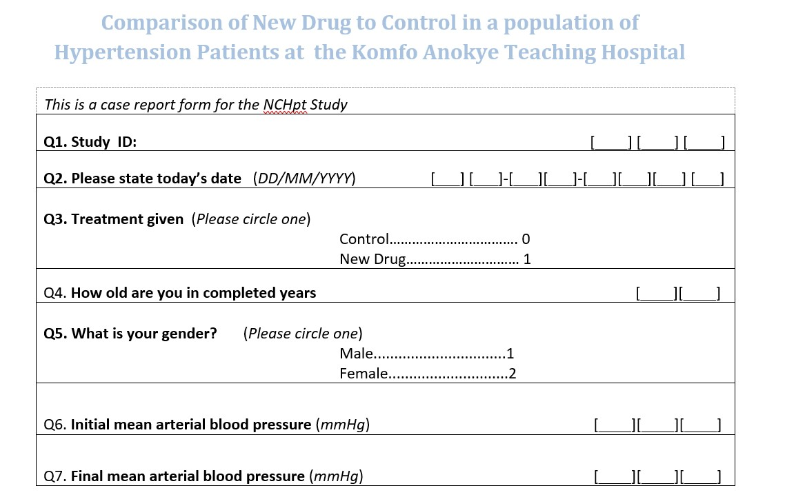
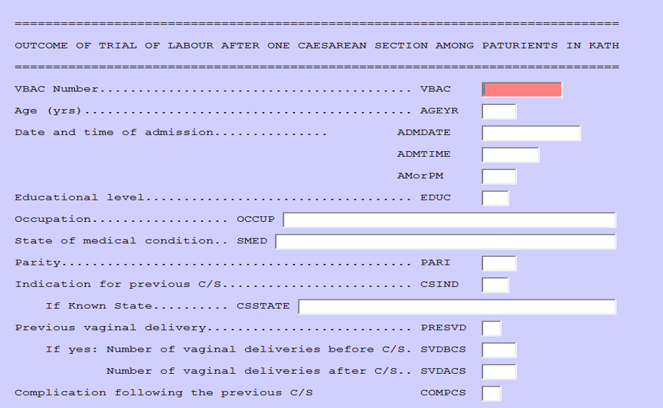
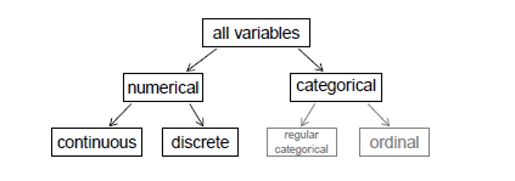
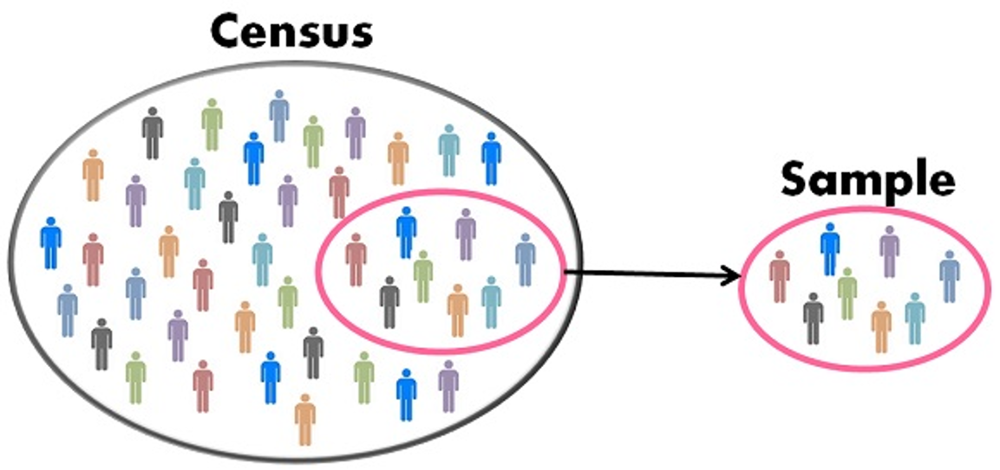
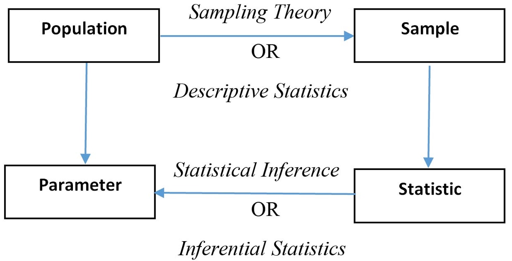
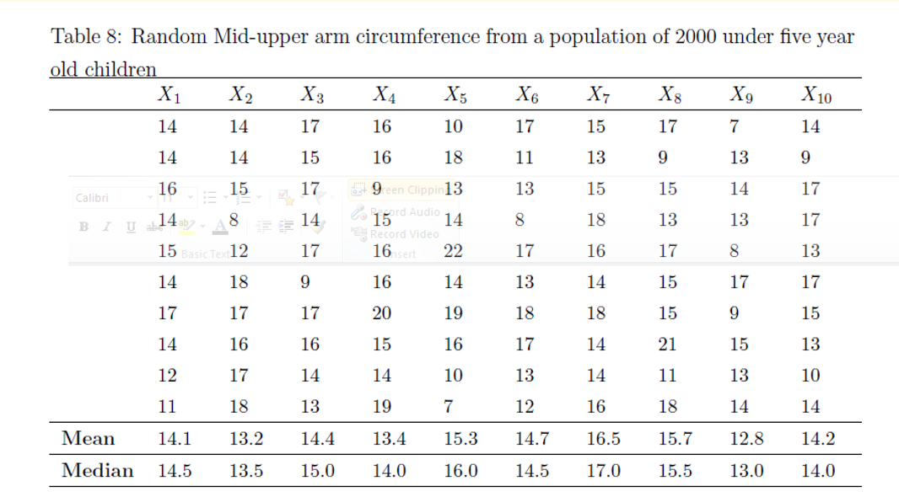
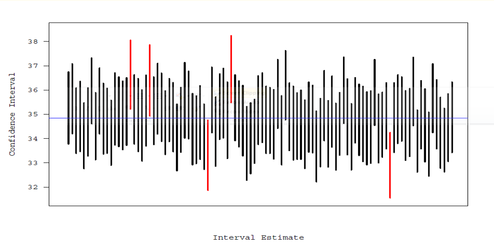
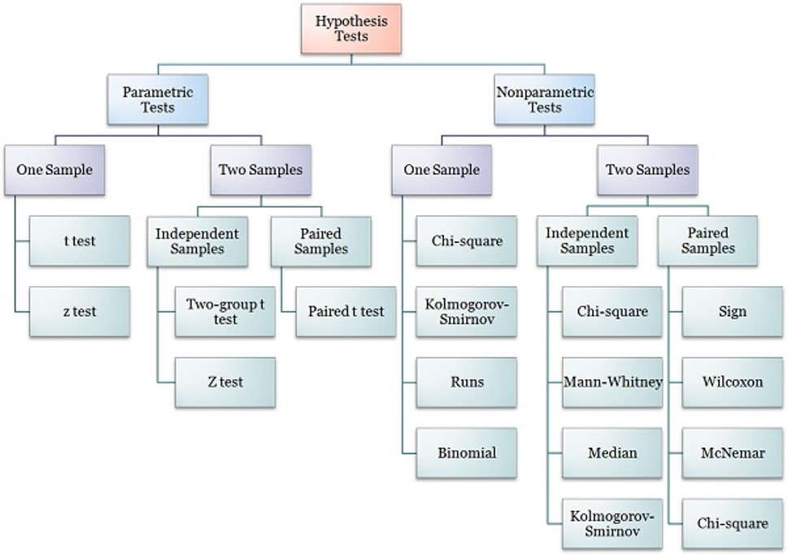

```{r setup, include = FALSE}
library(tidyverse)
library(knitr)
opts_chunk$set(echo = FALSE, fig.width = 7.252, fig.height = 4, dpi = 300)

xaringanExtra::use_tile_view()
xaringanExtra::use_animate_all(style = "fade")
xaringanExtra::use_scribble()
```
class: title-slide, left, middle

# `r rmarkdown::metadata$title`
# *`r rmarkdown::metadata$subtitle`*
----
<br> 
.right[
### `r rmarkdown::metadata$institute`
### `r rmarkdown::metadata$date`
`r rmarkdown::metadata$author` .title-t[FWACP FGCPS]
]


---
# Workshop outline
----
.pull-left[
## Data Management
- Databases software
- Database design & validation
- Data verification
    - Double 
    - Single 
- Data warehousing
- Data migration
- Data cleaning
]

.pull-left[
## Data Analysis
- Planning your analysis
    - Text, dummy tables and figures
- Software 
- Data cleaning and missing data
- Descriptive statistics
    - Continuous variables
    - Categorical variables
- Inferential statistics
    - Hypothesis testing
    - P-values
    - Confidence interval
- Graphical presentations
]

---
# Our study for the day
----

## Aim
- Determine if __New Drug__ has a better BP lowering effect after 2 weeks of administration compared to the __Control Drug__

## Study type
- Randomized Controlled Trial

## Variable to be collected
- Age in years
- Sex
- Initial BP
- Final BP

---
# Our study for the day
----
## Study questions
- How much does the **New drug** lower the BP?
- How much does the **Control drug** lower the BP?
- Which of the two drugs **lowers the BP better**?
- Is there a difference in the **BP lowering effect** of the two drugs?
- Is the **BP lowering effect** related to the **age** of the patient?
- Is the **BP lowering effect** related to the **sex** of the patient?

---
class: inverse
# Our study for the day
----


---
class: center, middle, inverse
# Data Management
----

---
class: center, middle
## Data management software
.pull-left[


]

.pull-right[


]

---
class: middle, center, inverse


---
class: middle, center, inverse


---
# Database design, validation and verification
----
.pull-left[
## Validation
- Limits
- Valid ranges
- Allowable values
- Some software better than others

## Cleaning
- Regular review of filled questionnaires
- Weekly checking of entered data for correctness
]

.pull-right[
## Verification
- **Single entry**
    - 10% verification
    - Whole database verification
- **Double entry**
    - Create identical database
    - Double enter data
    - Picks data entry errors
    - Compare the data from both databases
    - Identify discrepancies
    - Correct errors as necessary
]

---
class:
# Data Warehousing, migration & cleaning
----
.pull-left[
##Warehousing
- Backup the data regularly – 3 copies
- Backup with versions and dates
- Keep in the appropriate format
    - Microsoft Excel
    - Text files
    - PDF
    - Tiff 

## Migration
- Moving data around
- Should be in stable state
]

.pull-right[
- Not all software requires this

##Cleaning
- Involves picking out erroneous data
- Picks up
    - Data collection errors
    - Data entry errors
- Strategy depends on 
    - Continuous variable
    - Discrete variable
    - Categorical
    - Etc
]

---
class: center, middle, inverse
# Data Analysis
----

---
class: center, middle
#Data Types


---
# Variable types
## Independent (predictor) variable 
- Potentially influences, affects or predicts another variable
- E.g: How age influences income make age the independent variable

## Dependent (predicted) variable 
- Potentially predicted, influenced and affected by another variable
- E.g: How age influences income make income the dependent variable

---
# Data analysis
## Software
- R - Analysis only
- Microsoft Excel - Entry and analysis
- Stata - Analysis only
- SPSS - Entry and analysis

---
# Know your data
----
.pull-left[
```{r echo = F}
tbl_style <- function(df){
    df %>% 
        gt::gt() %>% 
        gt::tab_options(
            table.font.size = 20, 
            table.font.names = "serif", 
            data_row.padding = gt::px(2)
        ) %>% 
        gt::opt_stylize(style = 5)
}
```
## Variables
- `id`  = Study ID
- `treat` = Treatment given
- `age` = Age of participant
- `sex` = Sex of patient
- `bp1` = Initial mean arterial BP
- `bp2` = Final mean arterial BP
]

.pull-right[
```{r include=TRUE, warning=FALSE, message=FALSE}
newdrugdirty <-
    readstata13::read.dta13("Dataset/NewDrugDirty.dta")

newdrugdirty %>% 
    slice_head(n=15) %>% 
    tbl_style()
```
]

---
# Summarizing data
.center[
```{r echo=F, comment=NA, tidy=TRUE}
newdrugdirty %>% summary() 
```
]

---
# Pre-processing of data
----
.pull-left[
## Data cleaning 
- Involves picking out erroneous data
- Picks up
    - Data collection errors
    - Data entry errors
    - Strategy depends on 
    - Continuous variable  OR Discrete variable
]

.pull-right[
# Steps (personal)
- Check study id
    - Any duplication in whole data?
    - Any duplication in study id?
    - Any missing study id?
    - Sort them out if possible
- General overview of data
    - single categorical variables
    - Single  continuous variables
    - Combination of variables – Categorical
    - Combination of variables - Continuous
]

---
# Pre-processing of data
----
## Missing data
- Know the pattern
- Know how to deal with them
    - Dropping observations
    - Imputation
        - Commonest observation
        - Median/Mean
        - MICE

---
# Missing pattern
```{r echo=FALSE}
newdrugdirty %>% visdat::vis_miss()
```

---
# Pre-processing of data
----
## Generating new variables
1. Convert data to appropriate types
    - `sex` to categorical variable (factor)
    - `treat` to categorical variable
1. Fill missing data with appropriate data 
1. Correct abnormal values in BPs
1. Generate variable(s)
    - `bp_diff` = Difference in BP
    - `age_group`:
        - Elderly: >60 years
        - Middle age: <=60 years

---
# Data summary after cleaning
```{r warning=F, echo = F}
newdrug <-
    readstata13::read.dta13("Dataset/NewDrug.dta") %>% 
    mutate(
        treat = factor(
            treat, 
            labels = c("Old Drug","New Drug")
        ),
        sex = factor(sex, labels = c("Female","Male")),
        bp_diff = bp1-bp2,
        age_group = case_when(
            age > 60 ~ "Elderly",
            age <= 60 ~ "Middle age"
        ) %>% factor(levels = c("Middle age", "Elderly"))
    ) %>% 
    labelled::set_variable_labels(
        treat = "Treatment Type",
        age = "Age in years",
        sex = "Sex",
        bp1 = "Initial blood pressure (mmHg)",
        bp2 = "Blood Pressure after treatment",
        bp_diff = "Change in Blood Pressure",
        age_group = "Age Grouping"
    )
```

.center[
```{r echo=F, comment=NA, tidy=TRUE}
newdrug %>% summary() 
```
]

---
# Descriptive statistics
----
.pull-left[
# Categorical variable
- Frequency tables – univariate
- Contingency tables – bivariate
    - Row percentage
    - Column percentage
- Graphical representations
    - Bar chart
    - Pie Chart
    - Others
- Odds & Odds Ratio
- Risk & Risk Ratio
]

.pull-right[
## Continuous Variable
- Measures of central tendency
    - Mean
        - Arithmetic Mean
        - Geometric mean
        - Harmonic mean
    - Median
    - Mode
- Measures of dispersion
    - Standard deviation
    - Variance
    - Interquartile range
    - Range
]
 

---
# Categorical variables
----
.pull-left[
##Univariate analysis
```{r warning=F, echo = F}
newdrug %>% 
    gtsummary::tbl_summary(
        include = - c(id, bp1, bp2, age, bp_diff), 
        statistic = gtsummary::all_categorical() ~ c("{n} ({p})"),
        digits = gtsummary::all_categorical() ~ c(0,1)
    ) %>%
    gtsummary::bold_labels() %>% 
    gtsummary::add_stat_label() %>% 
    gtsummary:: modify_caption(caption = "**Table 1**: Univariate categorical table")
```
]

.pull-right[
## Bivariate analysis

```{r warning=F, echo = F}
newdrug %>% 
    gtsummary::tbl_cross(
        row = sex,
        col = treat,
        percent = "row"
    ) %>% 
# newdrug %>% 
#     gtsummary::tbl_summary(
#         by = treat,
#         include = - c(id, bp1, bp2, age, bp_diff), 
#         statistic = gtsummary::all_categorical() ~ c("{n} ({p})"),
#         digits = gtsummary::all_categorical() ~ c(0,1)
#     ) %>%
     gtsummary::bold_labels() %>% 
#     gtsummary::add_stat_label() %>% 
#     gtsummary::modify_spanning_header(gtsummary::all_stat_cols() ~ "**Treatment given**") %>%
#     gtsummary::add_overall() %>% 
     gtsummary:: modify_caption(caption = "**Table 2**: Bivariate categorical table") %>% 
     gtsummary::italicize_levels()
```
]

---
# Categorical variables
----
##Bivariate tables
```{r warning=F, echo = F}
newdrug %>%
    gtsummary::tbl_summary(
        by = treat,
        include = - c(id, bp1, bp2, age, bp_diff),
        statistic = gtsummary::all_categorical() ~ c("{n} ({p})"),
        digits = gtsummary::all_categorical() ~ c(0,1)
    ) %>%
     gtsummary::bold_labels() %>%
    gtsummary::add_stat_label() %>%
    gtsummary::modify_spanning_header(gtsummary::all_stat_cols() ~ "**Treatment given**") %>%
    gtsummary::add_overall() %>%
     gtsummary:: modify_caption(caption = "**Table 3**: Bivariate categorical table") %>% 
     gtsummary::italicize_levels()
```

---
# Categorical variables plots
----
.pull-left[
**Pie Chart** <br>
```{r fig.width=5}
newdrug %>% ggstatsplot::ggpiestats(
    x = sex, 
    title = "Figure I: Sex distribution",
    results.subtitle = F)
```
]

.pull-right[
**Bar Chart - Univariate** <br>
```{r fig.height=4}
newdrug %>%
    ggplot(aes(x = sex)) +
    geom_bar(color = "red", fill = "skyblue") +
    labs(title = "Barplot of count of sex") + 
    theme_classic()+
    scale_fill_brewer("set1")
```
]

---
# Categorical variables plots
----
**Barchart - Bivariate**
.pull-left[
```{r fig.height=6}
ggstatsplot::ggbarstats(
    data = newdrug,
    y = sex,
    x = treat,
    label = "both"
)
```

]

.pull-right[
```{r fig.height=6}
newdrug %>% 
    ggplot() +
    geom_bar(
        aes(x = sex, fill = treat),
        position = position_dodge(0.9)
    ) +
    labs(
        x = "Sex",
        y = "Frequency",
        title = "Bivariate Barchart"
    ) +
    theme_light()
```
]

---
# Measures of Asociation
----
.pull-left[
## Risk
- Risk (probability, likelihood)
    - Probability of outcome in a specified period
    - If 200 children in a boarding school ate rice and 28 had diarrhea then 
    
$$ R_𝑒 = \frac{28}{200} = 0.14 = 14\% $$
]

.pull-right[
## Odds
$$ = \frac{Risk\ of\ getting\ the\ disease}{(Risk\ of\ not\ getting\ the\ disease)} $$
$$ Odds_e = \frac{0.14}{1-0.14} = \frac{0.14}{0.86} \approx 0.16$$
]

---
# Measures of association
----
## Risk Ratio (RR)

$$= \frac{Incidence\ in\ the\ exposed}{Incidence\ in\ the\ non-exposed} = \frac{R_e}{𝑅_𝑢}$$
- Used for estimation of causal relationship
- Can be calculated in cohort studies
- Higher RR => Better causal relationship
    - RR=1      =>  No evidence of association
    - RR $\neq$ 1   =>  Exposure is harmful or protective

---
# Measures of association
----
## Odds Ratio (OR)

$$= \frac{Odds\ in\ the\ exposed}{Odds\ in\ the\ non-exposed} = \frac{Odds_e}{Odds_𝑢}$$
- Used for estimation of causal relationship
- Can be calculated in case-control studies
- Higher RR => Better causal relationship
    - OR=1      =>  No evidence of association
    - OR $\neq$ 1   =>  Exposure is harmful or protective

---
# Descriptive statistics
----
.pull-left[
## Measures of central tendency
- Mean 
- Median
- Mode
]

.pull-right[
##Measure of Dispersion
- Range 
    – Minimum to maximum 
- Interquartile range
    - p25 - p75
- Quartiles
    - Minimum, p25, p75, maximum
- Standard Deviation
- Variance
]

---
#Descriptive Statistics
----
.pull-left[
```{r message=FALSE, warning=FALSE}
gtsummary::theme_gtsummary_eda()
newdrug %>% 
    gtsummary::tbl_summary(
        include = c(bp1, bp2)
    ) %>% 
    gtsummary::bold_labels() %>% 
    gtsummary:: modify_caption(
        caption = "**Table 4**: Univariate descriptive statistics"
    )

gtsummary::reset_gtsummary_theme()
```
]

.pull-right[
```{r message=FALSE, warning=FALSE}
gtsummary::theme_gtsummary_eda()
newdrug %>% 
    gtsummary::tbl_summary(
        include = c(bp1, bp2, treat),
        by = treat
    ) %>% 
    gtsummary::bold_labels() %>% 
    gtsummary:: modify_caption(caption = "**Table 5**: Bivariate descriptive statistics")

gtsummary::reset_gtsummary_theme()
```
]

---
# Descriptive Statistics
----
.pull-left[
## Histogram

```{r fig.height=6, fig.width=6}
newdrug %>% 
    ggstatsplot::gghistostats(
        x=bp_diff,
        ggtheme = theme_classic(), 
        normal.curve = T, 
        binwidth = 5,
        normal.curve.args = list(size = 1, col = "red"),
        bin.args = list(color = "black", fill = "blue", alpha = 0.1),
        xlab = "Blood Pressure (mmHg)", 
        title = "Distribution of Blood pressure difference")
```
]

.pull-right[
## Boxplot
```{r fig.height=6}
newdrug %>% 
    ggplot() +
    geom_boxplot(aes(y=bp_diff)) +
    labs(y = "Difference in Blood Pressure (mmHg)")
```

]
---
#Descriptive Statistics - plots

.pull-left[
## Scatter plot
```{r fig.height=6, fig.width=6}
newdrug %>% 
    ggplot() +
    geom_point(aes(x = bp1, y = bp2), color = "blue") +
    labs(x = "BP before study", y = "BP after study") +
    theme_light()
```

]

.pull-right[
##Boxplot
```{r fig.height=6, fig.width=6}
newdrug %>% 
    ggplot() +
    geom_boxplot(aes(y = bp_diff, fill=sex)) +
    labs(y = "Difference in BP") +
    theme_light()
```
]


---
class: inverse middle center
# Inferential statistics
----
---
class: center, middle
#Sample vrs. Population


---
class: center, middle
#Statistic vrs. Parameter


---
class: center, middle
#Sample variation


---
#Estimates
----
- Point estimates
- Interval estimates

.red[**Confidence interval**]

.red[**The 95% confidence interval is the interval that is likely to contain the population  parameter 95% of the time.**]

---
class: center, middle
#95% Confidence interval


---
# p-value
----
- Well known in research
- Very often misinterpreted and overemphasized

> .red[**It is the probability of having a statistic as extreme as the one observed from the sample if the null hypothesis is true. It determines the strength of support for the null hypothesis.**]

- The nearer p-value is to 1 the better the data at hand or test statistic supports the null value.

---
#Hypothesis testing
----
1. State (Null) hypothesis (H0) 
1. Decide on significance level (α) usually 0.05
1. Determine sample size
1. Collect data (Evidence)
1. Apply appropriate statistical test
1. Compute the probability value (p-value) 
1. We compare the p-value with α 
    1. If p < α Then: Reject the H0 (Guilty)
    1. If p >= α Then: Refuse to reject the H0 (Not guilty)


Generally:
- Lower p-value: More confident of rejecting the H0
- Note that failure to reject H0 does not mean H0 is true. It means we do not have enough evidence to reject it

---
class: middle, center, inverse
# Statistical Tests


---
class: inverse middle center
# Answering our questions from our study

---
# How much does the New drug lower the BP?
# How much does the Control drug lower the BP?
# Which of the two drugs lowers the BP better?
----

```{r}
newdrug %>% 
    gtsummary::tbl_summary(
        by = treat,
        include = c(treat, bp_diff),
        statistic = gtsummary::all_continuous() ~ "{mean} ({sd})",
        digits = gtsummary::all_continuous() ~ 1
    ) %>% 
    gtsummary::add_ci()
```

---
# Is there a difference in the BP lowering effect of the two drugs?

**H0**: No difference in BP lowering effect between the two drugs

```{r}
newdrug %>% 
    gtsummary::tbl_summary(
        by = treat,
        include = c(treat, bp_diff),
        statistic = gtsummary::all_continuous() ~ "{mean} ({sd})",
        digits = gtsummary::all_continuous() ~ 1,
        
    ) %>% 
    gtsummary::add_p(test = gtsummary::all_continuous() ~ "t.test")
```

**Conclusion:** Based on the p-value we reject the H0 and thus conclude there is a significant difference between the BP lowering effect of the New drug and Control 

---
# Is the BP lowering effect related to the age of the patient?
----
.pull-left[
**H0**: BP lowering effect is not related to age

```{r}
lm(bp_diff ~ age, data= newdrug) %>%
  gtsummary::tbl_regression() %>% 
    gtsummary::bold_labels()

```

**Conclusion**: BP lowering effect not significantly related to the age of the patient.
]

.pull-right[
```{r fig.height=6, fig.width=6, message=FALSE, warning=FALSE}
newdrug %>% 
    ggplot(aes(x=age, y=bp_diff)) +
    geom_point(col = "red")+
    geom_smooth(method = "lm", se = T) +
    theme_light()+
    labs(x = "Age in years", y = "Change in BP")
```
]

---

```{r warning=FALSE, message=FALSE}
newdrug %>% 
    gtsummary::tbl_summary(
        include = -id,
        by = treat,
        statistic = gtsummary::all_continuous() ~ "{mean} ({sd})",
        digits = gtsummary::everything() ~ 1
    ) %>%
    gtsummary::modify_spanning_header(gtsummary::all_stat_cols() ~ "**Drug**") %>% 
    gtsummary::add_overall() %>% 
    gtsummary::add_p(test = gtsummary::all_continuous() ~ "t.test") %>% 
    gtsummary::bold_labels() %>% 
    gtsummary:: modify_caption(caption = "**Table 6**: Overall data outlook")
```
---
# Summary...
.pull-left[
### Data Management
- Database design
- Data entry
- Data validation
- Data verification
- Data cleaning
- Data warehousing
- Data transfer
]

.pull-right[
### Data Analysis
- Statistical software 
- Data cleaning
- Data analysis
    - Continuous variables
    - Categorical variables
    - Descriptive vrs. Inferential 
- Presentation of results
    - Tables
    - Figures
]

---
class: inverse middle center
<style>
.bye{
    font-size: 3em;
    font-weight: bold;
    /*font-style: italic;*/
    color: white;
}
</style>

.bye[
    Thank you!!! 
]
