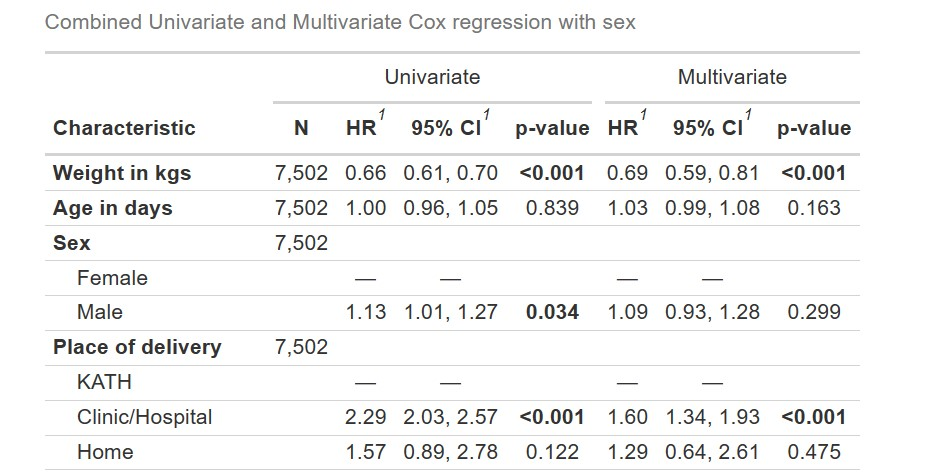
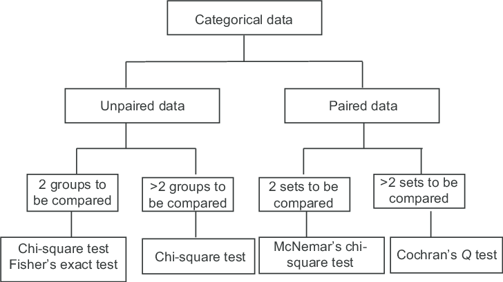
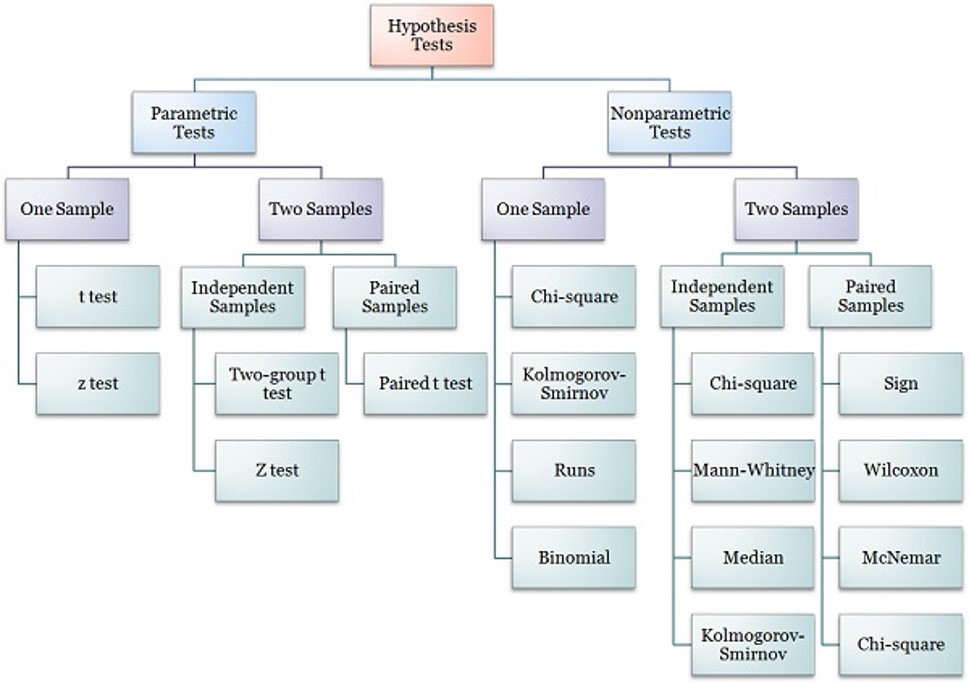

```{r setup, include = FALSE}
library(tidyverse)
library(knitr)
library(gtsummary)
opts_chunk$set(echo = FALSE, fig.width = 7.252, fig.height = 4, dpi = 300)

xaringanExtra::use_tile_view()
xaringanExtra::use_animate_all(style = "fade")
xaringanExtra::use_scribble()
xaringanExtra::use_panelset(in_xaringan = TRUE)
```

```{r include=TRUE, warning=FALSE, message=FALSE}
df_newdrug <-
    readstata13::read.dta13("Dataset/NewDrug.dta") %>% 
    mutate(
        treat = factor(
            treat, 
            labels = c("Old Drug","New Drug")
        ),
        sex = factor(sex, labels = c("Female","Male")),
        bp_diff = bp1-bp2,
        age_group = case_when(
            age > 60 ~ "Elderly",
            age <= 60 ~ "Middle age"
        ) %>% factor(levels = c("Middle age", "Elderly")),
        hpt = bp1>98
    ) %>% 
    labelled::set_variable_labels(
        treat = "Treatment Type",
        age = "Age in years",
        sex = "Sex",
        bp1 = "Initial blood pressure (mmHg)",
        bp2 = "Blood Pressure after treatment",
        bp_diff = "Change in Blood Pressure",
        age_group = "Age Grouping",
        hpt = "Hypertension"
    )

# function to calculate OR from 2x2 table
or_fun <- function(data, variable, by, ...) {
  table(data[[by]], data[[variable]]) %>%
    fisher.test() %>%
    broom::tidy()
}
```

class: title-slide, left, middle
# `r rmarkdown::metadata$title`
----
<br> 
.right[
### `r rmarkdown::metadata$institute`
### `r rmarkdown::metadata$date`
`r rmarkdown::metadata$author` .title-t[FWACP FGCPS]
]

---
class: inverse middle center
# No conflict of interest to declare.
----

---
# Outline
----
- Determinants of appropriate analysis
- Common pitfalls in analysis
- Descriptive vs Inferential statistics
- Parametric vs Non-parametric tests
- Analysis and presentation
    - Continuous variables
    - Categorical variables
    - Time to event analysis
- Confounding & Interaction


---
# Determinants of appropriate statistical analysis
----
- What is the research question(s) 
- What is/are the objective(s)?
- What type of variables were collected?
    - Relate variables required for each objective
- What is the study methodology?
- What is the sample size?
- How many .red[**missing variables**]?
- How do you intend to deal with missing?

---
# Common pitfalls

----

.pull-left[
## Statistical analysis
- Poorly written
- Does not conform to analysis done
- Wrong statistical tests applied
- Wrongful dichotomization
- Assumption of test not evaluated
- Missing data: How much was present and how they were dealt with.
- Analysis does not conform to basis for the sample size determination
]

.pull-right[
## Reporting
- P-value not reported as exact (NS)
- Wrong interpretation of P-value (Especially combo p-values)
- Data dredging (p-hacking)
- Ignoring confounders and effect modifiers
- Obvious bias: "Almost significant"
- Transcription errors.
]  

---
# An example statistical analysis

> Data Analysis: Statistical analysis was done with the Statistical Package for Social Sciences version 21.0 (Chicago Ill, IBM). Qualitative variables were summarized as frequencies (percentages), while quantitative variables were summarized as means (standard deviation). Student’s t-test, analysis of variance, or Chi-square test was used, as appropriate, to determine the statistical significance of the difference between the two groups. P <0.05 was taken as statistically significant.

---
# What is the research question?

----
Some study questions may appear "the same" but are very different!

--

.pull-left[
.red[Is there a difference in height between male and female residents?] 
]

.pull-right[
.red[Requires a **two-side** test.]
]

--

.pull-left[
.green[Are female residents taller than male residents?] 
]

.pull-right[
.green[Requires a **one-side** test.]
]


--

.pull-left[
.blue[Are male residents taller than female residents?] 
]

.pull-right[
.blue[Requires a **one-side** test.]
]

---
# What are the variables required?


----
- **Dependent** vs. **Independent** variables

.pull-left[
## Categorical 
- Nominal 
- Binary
- Ordinal
- Are some data missing?
- Are the groups balanced?
- What  are the proportions of the outcome and predictors?
]

.pull-right[
##Interval or ratio
- Continuous 
- Discrete
- What is the distribution, normal or non-normal?
- Are there outliers?
]

---
# Methodology

.panelset[

.panel[
.panel-name[Descriptive]
.pull-left[
##Scenario
- Describe what pertains 
- **What is the prevalence of hypertension among staff of the Komfo Anokye Teaching Hospital?**
]

.pull-right[
##Descriptive Analysis
###Categorical 
- Frequency, percentages

###Numeric
- Mean(SD)
- Median(IQR,Range)
- Percentiles
]
]

.panel[
.panel-name[Predictive]
## Scenario
- What is the relationship between two or more variables
- Can one variable predict the other

>**E.g.: What is the relationship between age and incidence of arthritis?**

##Method of Analysis
.pull-left[
- Agreement
- Correlation
]
.pull-right[
- Regression
- Survival 
]
]

.panel[
.panel-name[Comparative]
## Scenario
- Look for differences between groups
> **Is the prevalence of low back pain higher among Surgeons compared to Physicians**

## Analysis
.pull-left[
###Compare averages
- T-test,
- ANOVA
- etc
]

.pull-right[
###Compare proportions
- Chi-square test
- etc...
]
]
]


---
# Descriptive statistics
----
.pull-left[
## Categorical variable
- Frequency tables – univariate
- Contingency tables – bivariate
    - Row percentage
    - Column percentage
- Graphical representations
    - Bar chart
    - Pie Chart
    - Others
- Odds & Odds Ratio
- Risk & Risk Ratio
]

.pull-right[
## Continuous Variable
- Measures of central tendency
    - Mean
        - Arithmetic Mean
        - Geometric mean
        - Harmonic mean
    - Median
    - Mode
- Measures of dispersion
    - Standard deviation
    - Variance
    - Interquartile range
    - Range
]

---
#Inferential statistics
----
## Statistical tests
- p-value

##Estimates
- Point estimates
- Interval estimates
    - Confidence interval

> The 95% confidence interval is the interval that is likely to contain the population  parameter 95% of the time.


---
# Paramatric vs. Non-parametric test?

.panelset[
.panel[.panel-name[Outline]
.pull-left[
##Parametric
- Must be interval data
- Approximately normally distributed
- Approximately normally distributed on transformation
- Enough sample size?

E.g: T-test, ANOVA, etc
]
.pull-right[
##Non-parametric
- Alternative to parametric
- Does not require a specific distribution 
- Can handle low samples sizes
- Interpretation can be difficult
]
]

.panel[.panel-name[Assumption]
- Statistical tests have assumptions
- More stringent in parametric tests
- These should be evaluated for before using the test
- E.g.: For a Student's T-test:
    1. Independence of observations
    2. Normality of data
    3. Homogeneity of Variances
    4. Random Sampling methodology
    5. Adequacy of sample size
]
]

---
# Analysis - Single categorical 

.panelset[

.panel[.panel-name[Descriptive]
.pull-left[
Example: **What is the proportion of workers with diabetes mellitus in my study**

##Presentation 
- Frequency/Count
- Proportion
- Percentages
]

.pull-right[
```{r message = F, echo=F, warning =F}
df_newdrug %>% 
    gtsummary::tbl_summary(
        include = c(sex, age_group), 
        statistic = gtsummary::all_categorical() ~ c("{n} ({p})"),
        digits = gtsummary::all_categorical() ~ c(0,1)
    ) %>%
    gtsummary::bold_labels() %>% 
    gtsummary::add_stat_label() %>% 
    gtsummary:: modify_caption(caption = "**Table 1**: Univariate categorical table")
```
]
]

.panel[.panel-name[Inferential]
.pull-left[
Example: **What is the proportion of workers with diabetes mellitus in Ghana**

##Presenation 
- Frequency/Count
- Proportion
- Percentages
- Confidence intervals (Binomial)
]

.pull-right[
```{r message = F, echo=F, warning =F}
df_newdrug %>% 
    gtsummary::tbl_summary(
        include = c(sex, age_group), 
        statistic = gtsummary::all_categorical() ~ c("{n} ({p})"),
        digits = gtsummary::all_categorical() ~ c(0,1)
    ) %>%
    gtsummary::bold_labels() %>% 
    gtsummary::add_stat_label() %>% 
    gtsummary::add_ci() %>% 
    gtsummary:: modify_caption(caption = "**Table 1**: Univariate categorical table")
```
]
]
]

---
# Analysis - Two categorical 

.panelset[

.panel[.panel-name[Descriptive]
.pull-left[
Example: **What is the proportion of males who have DM in my study**

##Presenation 
- Frequency/Count
- Proportion
- Percentages - Row vs. Column
- Contingency table
]

.pull-right[
```{r message = F, echo=F, warning =F}
df_newdrug %>% 
    gtsummary::tbl_summary(
        by = sex,
        include = c(age_group), 
        statistic = gtsummary::all_categorical() ~ c("{n} ({p})"),
        digits = gtsummary::all_categorical() ~ c(0,1)
    ) %>%
    gtsummary::bold_labels() %>% 
    gtsummary::add_stat_label() %>% 
    gtsummary:: modify_caption(caption = "**Bivariate categorical table")
```
]
]

.panel[.panel-name[Inferential]
.pull-left[
Example: **Is having diabetes related to sex in Ghana?**

##Presenation 
- Confidence intervals
- p-value from appropriate statistical test
    - Chi-square test
    - Fisher's test
    - Etc
]

.pull-right[
```{r message = F, echo=F, warning =F}
df_newdrug %>% 
    gtsummary::tbl_summary(
        by = sex,
        include = c(age_group, treat), 
        statistic = gtsummary::all_categorical() ~ c("{n} ({p})"),
        digits = gtsummary::all_categorical() ~ c(0,1)
    ) %>%
    gtsummary::bold_labels() %>% 
    gtsummary::add_stat_label() %>% 
    gtsummary::add_p(pvalue_fun = ~ gtsummary::style_pvalue(.x, digits = 3)) %>% 
    gtsummary:: modify_caption(caption = "Bivariate categorical table")
```
]

.panel[.panel-name[Effect: OR]
```{r}
df_newdrug %>%
  tbl_summary(
      include = c(treat, sex, age_group),
      by = sex, 
      missing = "no", 
      statistic = all_categorical() ~ "{n} / {N} ({p}%)") %>%
  add_difference(
      pvalue_fun = ~ gtsummary::style_pvalue(.x, digits = 3),
      test = everything() ~ or_fun, 
      estimate_fun = everything() ~ style_ratio) %>%
  modify_header(estimate ~ "**Odds Ratio**") %>% 
  bold_labels()
```

]
]
]


---
# Analysis: Single numeric

.panelset[

.panel[.panel-name[Descriptive]

.pull-left[
Example: **What is the average hemoglobin of doctors in Kath**
##Presenation 
- Mean(SD)
- Median(IQR), 
- Median(Range)
]

.pull-right[
```{r message = F, echo=F, warning =F}
df_newdrug %>% 
    gtsummary::tbl_summary(
        include = c(age, bp1, bp2), 
        statistic = list(
            bp1 ~ c("{mean} ({sd})"),
            bp2 ~ c("{median} ({IQR})"),
            age ~ c("{median} ({min},{max})")),
        digits = gtsummary::all_categorical() ~ c(0,1)
    ) %>%
    gtsummary::bold_labels() %>% 
    gtsummary::add_stat_label() %>% 
    gtsummary:: modify_caption(caption = "**Table **: Univariate numeric table")
```

]
]

.panel[.panel-name[Inferential]
.pull-left[
Example: **What is the average Hemoglobin of Ghanaians?**

##Presenation 
- Mean(SD)
- Median(IQR), 
- Median(Range)
- Confidence interval
]

.pull-right[
```{r message = F, echo=F, warning =F}
df_newdrug %>% 
    gtsummary::tbl_summary(
        include = c(age, bp1, bp2), 
                statistic = list(
            bp1 ~ c("{mean} ({sd})"),
            bp2 ~ c("{median} ({IQR})"),
            age ~ c("{median} ({min},{max})")),
        digits = gtsummary::all_categorical() ~ c(0,1)
    ) %>%
    gtsummary::bold_labels() %>% 
    gtsummary::add_stat_label() %>% 
    gtsummary::add_ci() %>% 
    gtsummary:: modify_caption(caption = "**Table 1**: Univariate continuous")
```
]
]
]

---
# Analysis: Two continuous
.panelset[

.panel[
.panel-name[Difference]

Example: **What is the difference in weight between males and females?**

.pull-left[
## Tests - Unpaired
- Parametric: 
    - T-test (Unequal variance)
    - T-test (Equal variance)
- Non-parametric: 
    - Mann-Whitney U test
]

.pull-right[

## Test - Paired
- Parametric
    - Paired T-test
- Non-parametric
    - Wilcoxon-Signed rank test

]
]

.panel[
.panel-name[Difference 2]
```{r message = F, echo=F, warning =F}
df_newdrug %>% 
    gtsummary::tbl_summary(
        by = treat,
        include = c(age, bp1, bp2), 
        statistic = gtsummary::all_continuous()~c("{mean} ({sd})"),
        digits = gtsummary::all_categorical() ~ c(0,1)
    ) %>%
    gtsummary::bold_labels() %>% 
    gtsummary::add_stat_label() %>% 
    add_difference(pvalue_fun = ~ gtsummary::style_pvalue(.x, digits = 3)) %>% 
    gtsummary:: modify_caption(caption = "**Table**: Bivariate continuous")
```
]

.panel[
.panel-name[Correlation]
Example: **Does the serum lactate in children with severe malaria correlate with their hemoglobin concentration?**

.pull-left[
##Parametric
- Pearson correlation coefficient
- Confidence interval
- p-value


]
.pull-right[
## Non-parametric
- Spearman correlation coefficient
- Kendal's tau
- Confidence interval
- p-value
]
]

.panel[.panel-name[Relationship]
Example: **What is the relationship between age and mean blood pressure?**

.pull-left[
##Parametric
- Linear regression
]
.pull-right[
##Non-parametric 
- Non-linear regression
- Quantile regression
]
]
]

---
# Regression


.panelset[

.panel[.panel-name[Confounding]
.pull-left[
#Confounder
- Extraneous or nuisance pathway that the investigator hopes to rule out
- If present, it has to be adjusted for

>E.g: Relationship between Birth order, maternal age and Down Syndrome
]

.pull-right[
#Effect modifier
- The effect differs for the various groups
- Simply put! it depends.
- If present, the groups will have to be reported separately

>E.g: Salt intake, hypertension and age.
]
]

.panel[.panel-name[Linear]
.pull-left[

```{r}
df_newdrug %>% 
    select(sex, bp1, age) %>% 
    gtsummary::tbl_uvregression(
        method = lm,
        y = bp1,
         pvalue_fun = ~ gtsummary::style_pvalue(.x, digits = 3)
    ) %>%
    gtsummary::add_global_p() %>% 
    gtsummary::bold_labels() %>%
    gtsummary::bold_p(t = 0.2) %>%
    gtsummary::modify_caption("Univariate Linear regression")
```
]

.pull-right[


```{r}
df_newdrug %>% 
    select(sex, bp1, age) %>% 
    lm(bp1 ~ sex + age, data = .) %>% 
    gtsummary::tbl_regression( 
        pvalue_fun = ~ gtsummary::style_pvalue(.x, digits = 3)) %>%
    gtsummary::add_global_p() %>% 
    gtsummary::bold_labels() %>%
    gtsummary::bold_p(t = 0.2) %>%
    gtsummary::modify_caption("Multivariate Linear regression")
```
]
]

.panel[.panel-name[Logistic]
.pull-left[

```{r}
df_newdrug %>% 
    select(hpt, sex, age) %>% 
    gtsummary::tbl_uvregression(
        method = glm,
        y = hpt,
        exponentiate = TRUE,
         pvalue_fun = ~ gtsummary::style_pvalue(.x, digits = 3)
    ) %>%
    gtsummary::add_global_p() %>% 
    gtsummary::bold_labels() %>%
    gtsummary::bold_p(t = 0.2) %>%
    gtsummary::modify_caption("Univariate Logistic regression")
```
]

.pull-right[


```{r}
df_newdrug %>% 
    select(sex, hpt, age) %>% 
    glm(hpt ~ sex + age, family = "binomial", data = .) %>% 
    gtsummary::tbl_regression(
        exponentiate = T,
         pvalue_fun = ~ gtsummary::style_pvalue(.x, digits = 3)) %>%
    gtsummary::add_global_p() %>% 
    gtsummary::bold_labels() %>%
    gtsummary::bold_p(t = 0.2) %>%
    gtsummary::modify_caption("Multivariate logistic regression")
```
]
]

.panel[.panel-name[Interaction]

.pull-left[


```{r}
df_newdrug %>% 
    select(sex, bp1, age) %>% 
    lm(bp1 ~ sex*age, data = .) %>% 
    gtsummary::tbl_regression(
         pvalue_fun = ~ gtsummary::style_pvalue(.x, digits = 3)
    ) %>%
    gtsummary::add_global_p() %>% 
    gtsummary::bold_labels() %>%
    gtsummary::bold_p(t = 0.2) %>%
    gtsummary::modify_caption("Multivariate Linear regression - Interaction")
```
]

.pull-right[

```{r}
df_newdrug %>% 
    select(sex, hpt, age) %>% 
    glm(hpt ~ sex*age, family = "binomial", data = .) %>% 
    gtsummary::tbl_regression(
        exponentiate = T,
         pvalue_fun = ~ gtsummary::style_pvalue(.x, digits = 3)) %>%
    gtsummary::add_global_p() %>% 
    gtsummary::bold_labels() %>%
    gtsummary::bold_p(t = 0.2) %>%
    gtsummary::modify_caption("Multivariate logistic regression - interaction")
```
]
]
.panel[.panel-name[Cox's]

]
]

---
class: inverse 
#Summary of tests: Categorical



.footnote[https://www.researchgate.net/figure/Common-statistical-tests-to-compare-categorical-data-for-difference_fig1_305213637]


---
class: inverse
#Summary of tests: Numeric



.footnote[https://www.slideshare.net/ShefaliJain74/overview-of-different-statistical-tests-used-in-epidemiological]

---
# Summary
----
- Determinants of appropriate analysis
- Common pitfalls in analysis
- Descriptive vs Inferential statistics
- Parametric vs Non-parametric tests
- Analysis and presentation
    - Continuous variables
    - Categorical variables
    - Time to event analysis
- Confounding & Interaction

---
background-image: url("Images/take_home_message.jpg")
background-position: bottom right
background-size: 35%, 35%
# Take home ...
>Good results from a study comes from planning, appropriate sample size, application of the right statistical techniques and appropriate presentation of the data.  

---
class: inverse middle center
<style>
.bye{
    font-size: 3em;
    font-weight: bold;
    /*font-style: italic;*/
    color: white;
}
</style>

.bye[
    Thank you!!!
]